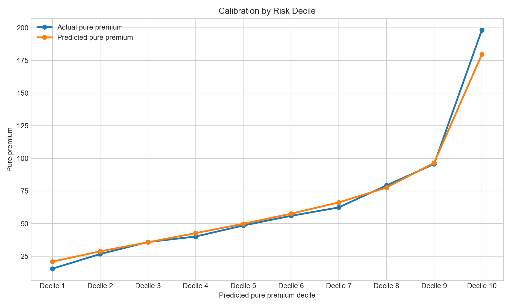
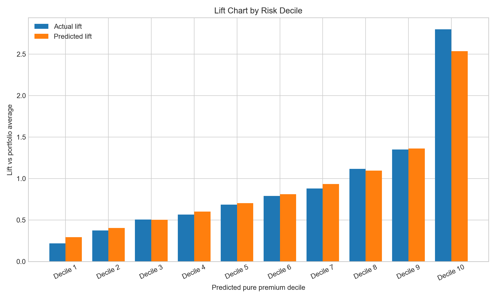
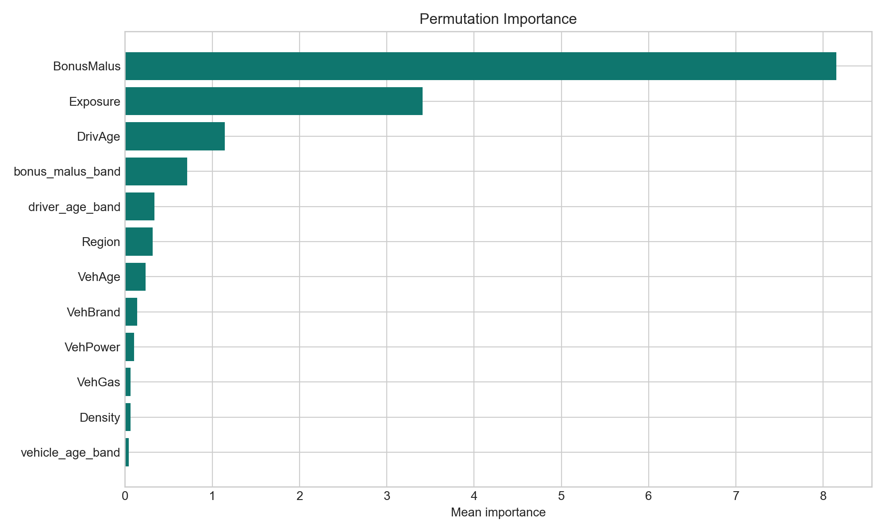

# Motor Insurance Pricing Risk Dashboard

## Project Overview

Motor Insurance Pricing Risk Dashboard is an end-to-end pricing and underwriting analytics project built on the public French Motor Third-Party Liability claims dataset (`freMTPL2`). The project estimates expected claim cost at the policy level, models claim frequency, organizes the portfolio into risk deciles, evaluates pricing adequacy against a baseline premium, and presents the outputs through a professional Streamlit dashboard designed to feel like a real internal pricing tool.

Shared logic lives in `src/`, the notebook documents the analytical workflow, and the Streamlit application exposes the same outputs through an interactive interface for portfolio monitoring and policy-level scoring.

## Executive Summary

### Key findings

- The best-performing pure premium model in the validated run was `HistGradientBoostingRegressor`, outperforming the Tweedie GLM on holdout RMSE and mean Tweedie deviance.
- The highest predicted risk segment was `Decile 10`, with actual pure premium at roughly `2.8x` the portfolio average, making it the clearest candidate for rate uplift or tighter underwriting appetite.
- About `17.6%` of holdout policies were flagged as `Underpriced / high expected loss`, helping focus pricing intervention on a narrower portion of the book.
- `BonusMalus`, exposure, driver age, and vehicle age emerged as the strongest practical drivers of expected claim cost differentiation.

### Business implications

- Risk segmentation provides a disciplined way to distinguish policies that are likely profitable, broadly adequate, or likely to erode loss ratio performance.
- Pricing adequacy flags translate model output into business action by identifying where premium levels may need strengthening versus where the book may support competitive growth.
- A separate claim frequency view helps maintain underwriting intuition even when the final pricing recommendation is anchored on pure premium.
- Policy-level scoring makes the project useful beyond portfolio reporting by showing how a single risk would likely be assessed in a quoting or referral context.

## Motivation

Motor insurance pricing sits at the intersection of competitiveness and risk control. A public claims dataset cannot fully reproduce a carrier pricing stack, but it can still demonstrate the core pricing workflow:

- Which policies appear materially riskier than the rest of the portfolio?
- Which parts of the book look underpriced relative to expected loss cost?
- Which rating variables create the clearest separation in expected claim outcomes?
- How well do model predictions align with realized loss cost across risk bands?
- How can those outputs be communicated in a way that is usable by pricing and underwriting stakeholders?

The goal is not unnecessary modeling complexity. The goal is to show a clean, credible, business-aware workflow for pricing analytics.

## Objectives

The dashboard is organized around five practical pricing modules:

1. Executive portfolio overview with pricing KPIs and adequacy summary.
2. Risk segmentation using predicted pure premium deciles.
3. Model performance analysis with calibration, lift, and feature importance.
4. Pricing adequacy review against a baseline premium with risk loading.
5. Policy scoring demo for user-entered risk attributes.

## Business Questions And Analytical Approach

| Business Question | Analytical Approach | Primary Output |
|---|---|---|
| Which policies carry the highest expected claim cost? | Pure premium modeling with Tweedie GLM and tree-based benchmark | Policy-level pure premium predictions and risk deciles |
| Which policies are likely underpriced versus expected loss? | Baseline premium simulation using portfolio average pure premium plus risk loading | Adequacy labels and recommendation summary |
| How well do predictions line up with actual outcomes? | Holdout evaluation with calibration by decile, lift, MAE, RMSE, and Tweedie deviance | Calibration and lift charts, metrics tables |
| Which rating features matter most? | Encoded rating variables plus permutation importance on the best model | Ranked feature importance output |
| How could this be used at quote time? | Interactive policy scoring with live prediction and adequacy classification | Policy-level scoring demo in Streamlit |

## Dataset

This project uses the public French Motor Third-Party Liability claims dataset made available through OpenML:

- `freMTPL2freq`: policy exposure and rating features for motor liability policies
- `freMTPL2sev`: claim amount records linked by policy identifier

### Data loading strategy

The project is designed to run reproducibly:

1. Try `sklearn.datasets.fetch_openml` first.
2. Fall back to direct OpenML CSV download URLs if the OpenML client path fails.

### Engineered targets

- `claim_frequency = ClaimNb / Exposure`
- `total_claim_amount`
- `pure_premium = total_claim_amount / Exposure`

The pipeline also caps extreme severity and pure premium values at the 99th percentile to reduce distortion from large outliers.

## Development Strategy

The code is intentionally lightweight and recruiter-friendly: a single processed dataset, sklearn pipelines, saved model artifacts, clear reporting tables, and a dashboard that can run locally without hidden infrastructure dependencies.

The processed portfolio adds business-ready transformations such as:

- driver age bands
- vehicle age bands
- BonusMalus bands
- density bands
- categorical encoding for territory and vehicle characteristics
- pricing adequacy classification and recommendation logic

## Project Structure

```text
motor-insurance-pricing-risk-dashboard/
|-- app
|   `-- streamlit_app.py
|-- data
|   |-- openml_cache
|   `-- processed
|-- models
|-- notebooks
|   `-- 01_pricing_modeling.ipynb
|-- reports
|   |-- figures
|   |-- dashboard_kpis.json
|   |-- feature_importance.csv
|   |-- holdout_predictions.csv
|   |-- model_metrics.csv
|   |-- pricing_adequacy_summary.csv
|   `-- risk_decile_summary.csv
|-- src
|   |-- __init__.py
|   |-- data_prep.py
|   |-- evaluate.py
|   |-- train_model.py
|   `-- utils.py
|-- .gitignore
|-- README.md
`-- requirements.txt
```

## Methodology

### 1. Data preparation

The preparation pipeline:

- loads frequency and severity data
- aggregates claim amounts by policy
- joins claims back to policy exposures using `IDpol`
- builds `claim_frequency`, `total_claim_amount`, and `pure_premium`
- caps extreme targets at the 99th percentile
- creates underwriting-friendly feature bands
- saves the processed dataset for downstream modeling

### 2. Modeling

Three supervised models are trained:

- `TweedieRegressor` for pure premium
- `PoissonRegressor` for claim frequency
- `HistGradientBoostingRegressor` as the tree-based pure premium benchmark

All models use a train/test split and sklearn preprocessing pipelines with categorical encoding and scaling where appropriate.

### 3. Evaluation

The project produces:

- holdout `MAE`
- holdout `RMSE`
- mean Tweedie deviance
- actual vs predicted pure premium by risk decile
- calibration and lift charts
- permutation importance
- pricing adequacy summary tables

### 4. Pricing adequacy logic

A simple business baseline is simulated as:

`baseline premium = portfolio average pure premium x (1 + 15% risk loading)`

Policies are then classified as:

- `Underpriced / high expected loss`
- `Adequately priced`
- `Competitive opportunity / lower risk`

## Validated Results

The pipeline was run locally end to end on the processed portfolio and produced the following holdout results:

| Model | MAE | RMSE | Mean Tweedie Deviance |
|---|---:|---:|---:|
| TweedieRegressor | 134.08 | 378.23 | 51.51 |
| HistGradientBoostingRegressor | 131.98 | 374.61 | 49.81 |
| PoissonRegressor (frequency) | 0.139 | 0.488 | 1.636 |

### Portfolio summary from the validated run

- Best pure premium model: `HistGradientBoostingRegressor`
- Portfolio average pure premium: `$71`
- Baseline premium with 15% loading: `$81`
- Underpriced share of holdout portfolio: `17.6%`
- Highest risk segment: `Decile 10`
- Strongest feature signal: `BonusMalus`

## Dashboard

The Streamlit application includes five pages:

- Executive Overview
- Risk Segmentation
- Model Performance
- Pricing Adequacy
- Policy Scoring Demo

### Visual Outputs

The repo includes generated analysis figures:





## How To Run Locally

```bash
python3 -m venv .venv
source .venv/bin/activate
pip install -r requirements.txt

python src/data_prep.py
python src/train_model.py
python src/evaluate.py
streamlit run app/streamlit_app.py
```

Then open `http://localhost:8501`.

## Key Business Insights

- The top risk decile carries a meaningfully higher loss-cost profile than the rest of the portfolio, making decile-based pricing governance a useful summary layer for underwriting and rate review.
- A relatively modest underpriced share suggests pricing attention can be focused on concentrated areas of the book instead of broad portfolio-wide increases.
- The model hierarchy is intuitive from a pricing perspective: prior experience (`BonusMalus`), exposure, and age-based variables drive much of the expected claim cost separation.
- The dashboard format makes the project more than a modeling exercise by connecting technical output to commercial and underwriting action.

## Author

**Shwetha Tinnium Raju**
